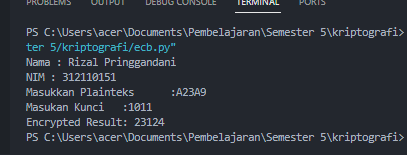

# Kripto_ECB
## Nama  :Rizal Pringgandani
## NIM   :312110151
## Kelas :TI.21.A2

## Algoritma
1. Masukkan plaintek dalam hexadecimal
2. Masukkan kunci biner
3. Rubah plaintek hexadecimal ke biner
4. Setlah biner, pisah per blok 4 bit seusai Panjang blok 5. Xorkan biner plainteks perblok dengan kunci
6. Geser tiap blok 1 bit ke kiri
7. Hasil xor konversi ke hexadecimal
